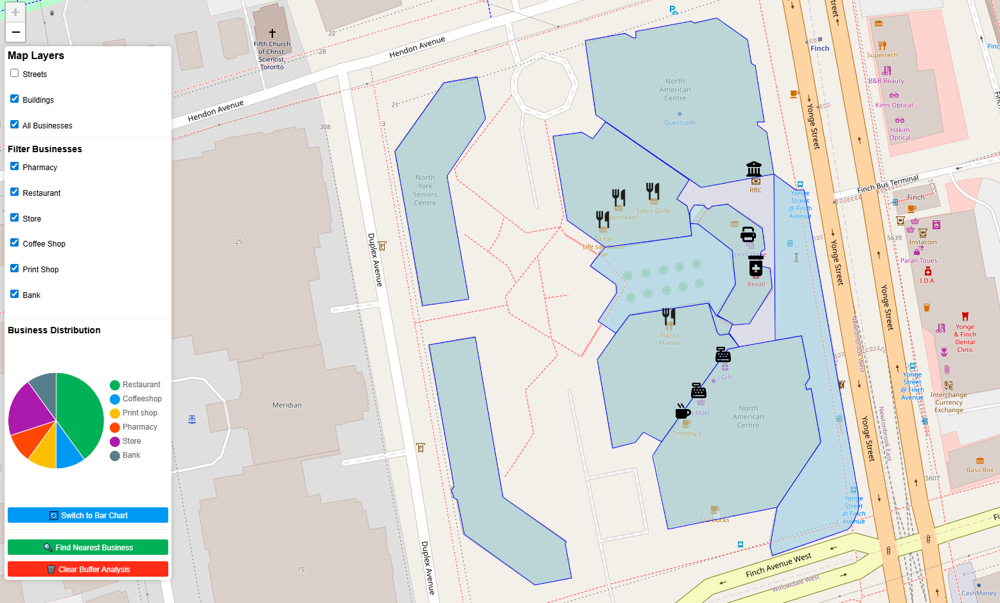
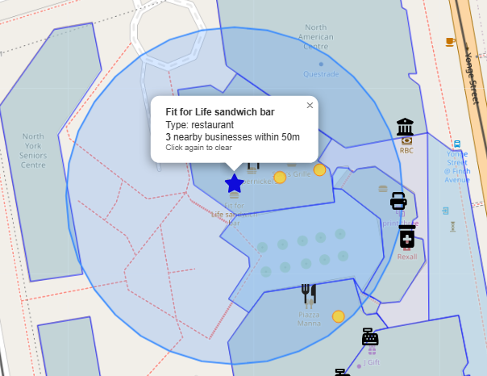
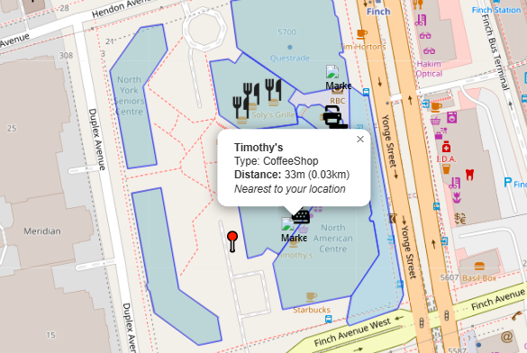
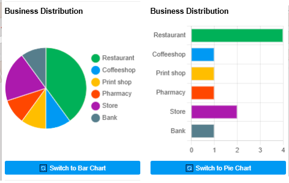

# Advanced GIS WebApp – Phase 1: Static GIS Web Map with Leaflet & GeoJSON

This project is the **first phase** of a multi-part GIS application, showcasing modern web-based mapping and spatial analysis using **Leaflet.js**, **Turf.js**, and **GeoJSON**. It visualizes digitized geographic data from a Toronto neighborhood and provides interactive tools for analysis and exploration.

## 🌍 Live Demo
📎 [View the live map on GitHub Pages](https://essamun.github.io/Advanced-GIS-WebApp-Frontend/)

---

## 🧰 Tools & Technologies

 **QGIS** – Digitization and geodatabase creation  
- **Leaflet.js** – Interactive mapping library  
- **Turf.js** – Client-side geospatial processing (buffer, distance)  
- **Chart.js** – Data visualization (bar/pie charts)  
- **GeoJSON** – Web-ready spatial data format  

---

## 🗂️ Features

✅ **Multiple GIS Layers**  
&nbsp;&nbsp;&nbsp;&nbsp;- Buildings, streets, and business points digitized via QGIS and displayed via Leaflet  

✅ **Custom Icons**  
&nbsp;&nbsp;&nbsp;&nbsp;- Different business types visualized with distinct icons  

✅ **Sidebar UI**  
&nbsp;&nbsp;&nbsp;&nbsp;- Toggle layers, filter by business type  

✅ **Spatial Analysis Tools**  
&nbsp;&nbsp;&nbsp;&nbsp;- *Buffer Tool*: Find businesses within 500m of a selected one  
&nbsp;&nbsp;&nbsp;&nbsp;- *Nearest Business Tool*: Click any location to identify the closest business  

✅ **Business Analytics**  
&nbsp;&nbsp;&nbsp;&nbsp;- Toggle between pie/bar charts to display business counts by type  

✅ **Fully Static & Client-Side**  
&nbsp;&nbsp;&nbsp;&nbsp;- Entirely functional using just HTML/JS/CSS hosted on GitHub Pages  

---

## 🖼️ Screenshots

| Feature | View |
|--------|------|
| Full Map Overview |  |
| Filter by Business Type |  |
| Buffer Analysis |  |
| Nearest Business Tool |  |
| Chart Toggle |  |

---

## 📁 Project Structure
📂 Advanced-GIS-WebApp-Frontend

├── 📁 data               # GeoJSON files for each layer

├── 📁 images             # Custom icons

├── 📁 screenshots        # Screenshots for documentation

├── 📄 index.html         # Main web page

├── 📄 style.css          # Map and UI styling

├── 📄 main.js            # Leaflet map and tools

├── 📄 chart.js           # Business chart generation

├── 📄 turf-tools.js      # Buffer and distance calculations

└── 📄 README.md          # This file

---

## 🚀 Next Phases

This project is part of a **multi-phase GIS web application**:

1. **Phase 1 – Static GIS Map (this repo)**
2. [Completed] **Phase 2 – Flask + PostGIS backend for dynamic querying**
3. [Planned] **Phase 3 – ML-enhanced GIS tools (clustering, predictions)**

## 📌 About the Author

👤 Essam Afifi
Canadian Data & AI Consultant | GIS Developer | Full-Stack Engineer
20+ Years of Experience | MSc in Geomatics | PMP® Certified
Fluent in English 🇬🇧, French 🇫🇷, and Arabic 🇪🇬

🌍 LinkedIn: [Essam Afifi](https://www.linkedin.com/in/essam-afifi-a38a3a362/)
📫 (esstoronto#gmail.com)

Passionate about delivering data-driven solutions with a blend of geospatial intelligence, machine learning, and modern web technologies. Specializing in Python, .NET, PostGIS, Leaflet, and cloud-based spatial systems.

---

