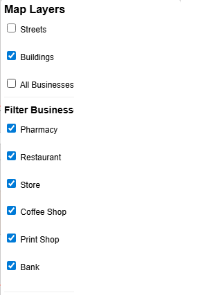

# Advanced GIS WebApp – Phase 1: Static GIS Web Map with Leaflet & GeoJSON

This project is the **first phase** of a multi-part GIS application, showcasing modern web-based mapping and spatial analysis using **Leaflet.js**, **Turf.js**, and **GeoJSON**. It visualizes digitized geographic data from a Toronto neighborhood and provides interactive tools for analysis and exploration.

## 🌍 Live Demo
📎 [View the live map on GitHub Pages](https://your-username.github.io/Advanced-GIS-WebApp-Frontend/)

---

## 🧰 Tools & Technologies
- **QGIS** for spatial data digitization
- **GeoJSON** as the web-ready spatial format
- **Leaflet.js** for web map rendering
- **Turf.js** for client-side spatial analysis (buffer, distance)
- **Chart.js** for business-type visualization

---

## 🗂️ Features

- ✅ **Multiple GIS layers**: buildings, streets, and business points
- ✅ **Custom icons** for different business types
- ✅ **Sidebar UI** for toggling layers and filtering business types
- ✅ **Buffer analysis**: find businesses within 200 meters of any selected one
- ✅ **Nearest business tool**: click anywhere to locate the closest business
- ✅ **Charts**: Pie and Bar chart toggle showing business counts

---

## 🖼️ Screenshots

| Feature | View |
|--------|------|
| Full Map Overview |  |
| Filter by Business Type |  |
| Buffer Analysis |  |
| Nearest Business Tool |  |
| Chart Toggle |  |

---

## 📌 About the Author

👤 **Essam T.**  
MSc Geomatics | Full-Stack Web Developer | Machine Learning Practitioner  
Specializing in GIS, Python, and modern web-based spatial solutions.

---

## 🚀 Next Phases

This project is part of a **multi-phase GIS web application**:

1. **Phase 1 – Static GIS Map (this repo)**
2. [Planned] **Phase 2 – Flask + PostGIS backend for dynamic querying**
3. [Planned] **Phase 3 – ML-enhanced GIS tools (clustering, predictions)**

Follow me on [GitHub](https://github.com/essamun) for updates.

